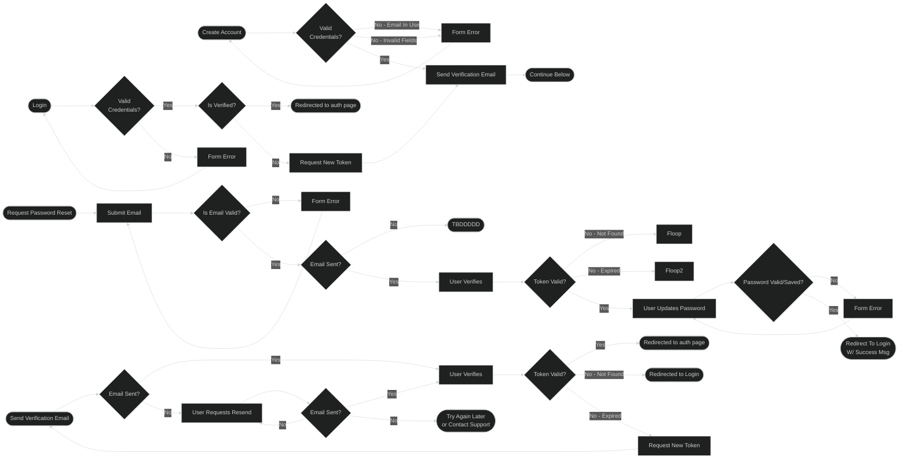
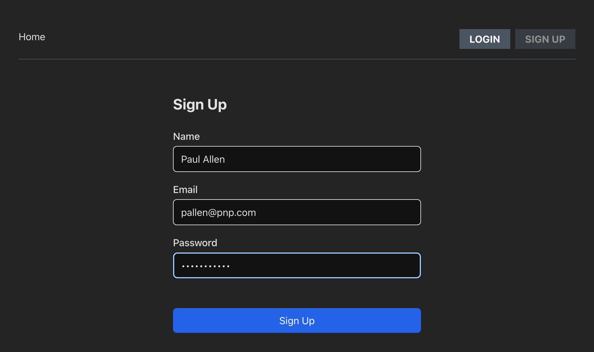
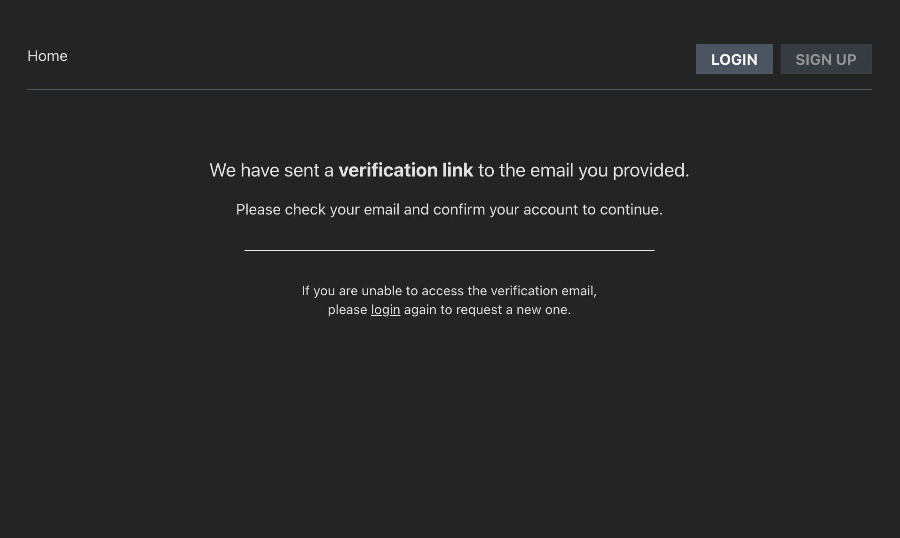
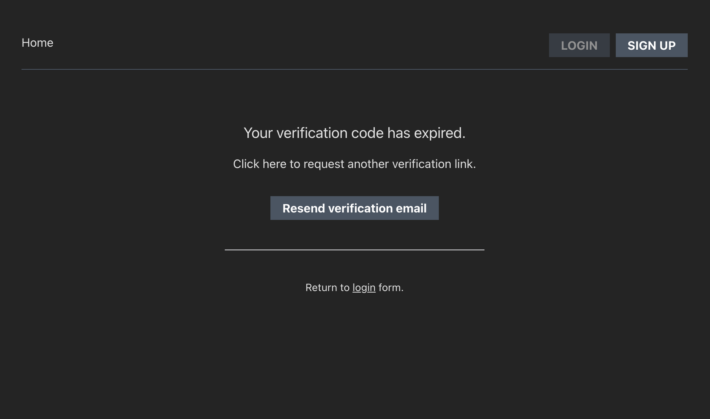
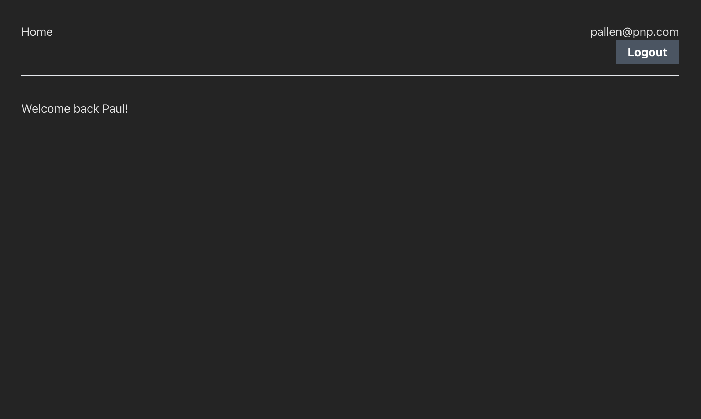
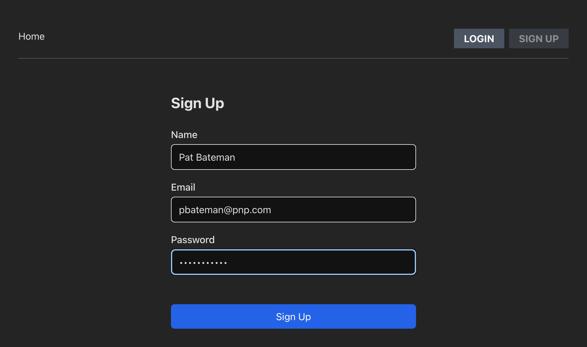
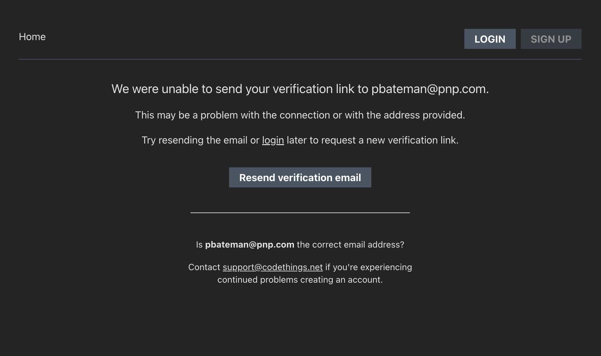
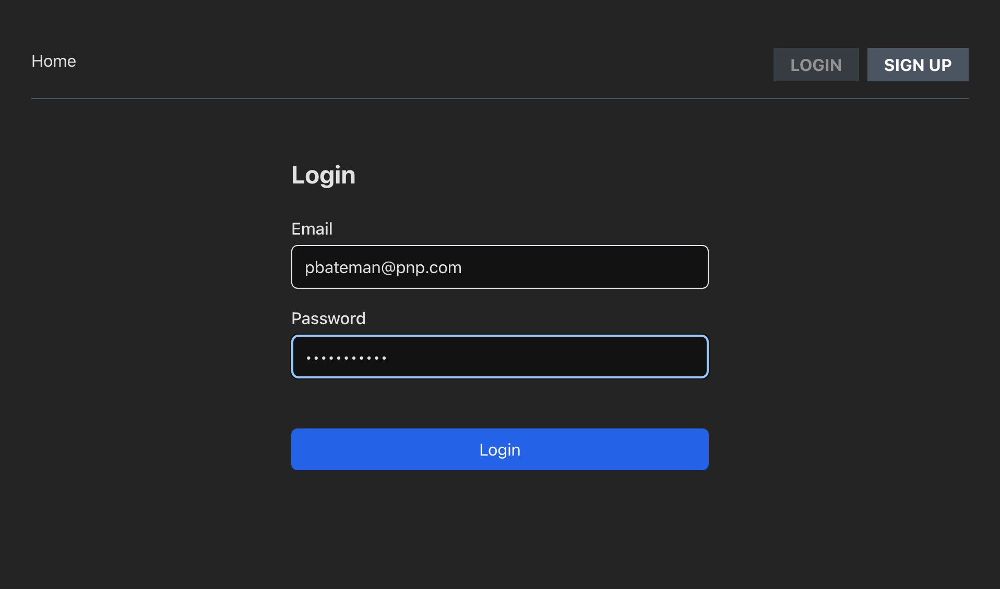
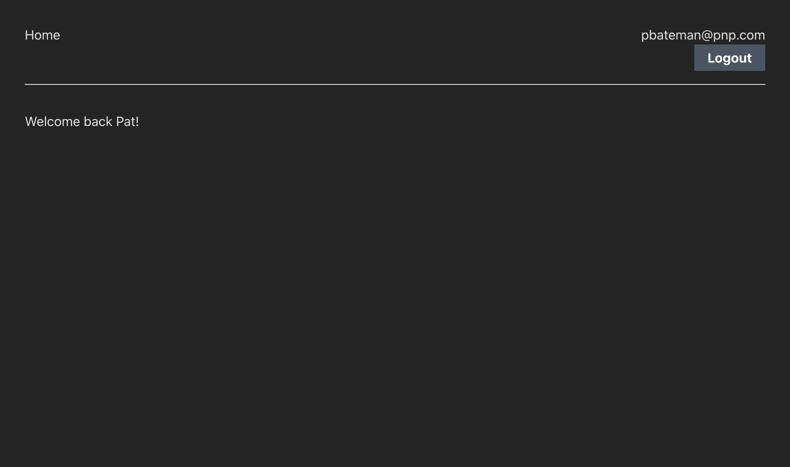

# User Auth Workflow

```mermaid
%%{init: {
  "theme": "dark", 
  "themeVariables": { 
    "primaryColor": "#ff6e6e", 
    "secondaryColor": "#feb236", 
    "tertiaryColor": "#6cb1ff" 
  },
  "flowchart": {
    "htmlLabels": true,
    "curve": "basis"
  },
  "height": "100%",
  "width": "100%",
  "startOnLoad": true,
  "securityLevel": "loose" }}%%

flowchart LR
    CreateAccount([Create Account]) --> IsValidCredentials{Valid<br>Credentials?}
    IsValidCredentials --> |No - Email In Use| ReturnError[Form Error] --> CreateAccount
    IsValidCredentials --> |No - Invalid Fields| ReturnError    
    IsValidCredentials --> |Yes| SendEmail[Send Verification Email] --> Continue([Continue Below])

    Login([Login]) --> IsValidLoginCredentials{Valid<br>Credentials?}
    IsValidLoginCredentials{Valid<br>Credentials?} --> |Yes| IsVerified{Is Verified?}
    IsValidLoginCredentials{Valid<br>Credentials?} --> |No| LoginError[Form Error]
    LoginError --> Login
    IsVerified --> |Yes| AuthPage([Redirected to auth page])
    IsVerified --> |No| RequestToken[Request New Token] --> SendEmail

    
    SendEmail2([Send Verification Email]) --> WasEmailSent{Email Sent?}
    WasEmailSent --> |Yes| UserVerifies[User Verifies] --> TokenValid{Token Valid?} --> |Yes| Verified([Redirected to auth page])
    TokenValid{Token Valid?} --> |No - Not Found| Login2([Redirected to Login])
    TokenValid{Token Valid?} --> |No - Expired| RequestNew[Request New Token] --> SendEmail2
    WasEmailSent --> |No| Rerequest[User Requests Resend] --> WasEmailSent2{Email Sent?} --> |Yes| UserVerifies
    WasEmailSent2 --> |No| Rerequest
    WasEmailSent2 --> |No| TryLater([Try Again Later<br>or Contact Support])

    RequestPasswordReset([Request Password Reset]) --> SubmitEmail[Submit Email]
    SubmitEmail --> IsEmailValid{Is Email Valid?}
    IsEmailValid --> |No| FormError3[Form Error] --> SubmitEmail
    IsEmailValid --> |Yes| EmailSent3{Email Sent?} --> |No| RerequestEmail([TBDDDDD])
    EmailSent3 --> |Yes| UserVerifies3[User Verifies] --> TokenValid3{Token Valid?} --> |No - Not Found| Floop[Floop]
    TokenValid3 --> |No - Expired| Floop2[Floop2]
    TokenValid3 --> |Yes| UserUpdatesPassword[User Updates Password] --> PasswordValidSaved{Password Valid/Saved?} --> |No| FormError4[Form Error] --> UserUpdatesPassword
    PasswordValidSaved --> |Yes| RedirectToLogin([Redirect To Login<br/>W/ Success Msg])
```

    
# UI

---

---

--- 

---

---

---

---

---

---

## Auth Flow (Detailed)

```mermaid
%%{init: {"theme": "dark", "themeVariables": { "primaryColor": "#ff6e6e", "secondaryColor": "#feb236", "tertiaryColor": "#6cb1ff" }}}%%

sequenceDiagram
  participant User
  participant Website
  participant AuthService
  participant Database
  participant EmailService

  rect rgb(0, 20, 20)
    Note over User,EmailService: [Primary Flow] 1. Registration Flow #ff6e6e
    User->>Website: Create Account
    Website->>AuthService: POST registration fields
    AuthService->>Database: Create unverified user 
    AuthService->>Database: Create and store verification token for user
    AuthService->>EmailService: Send verification email
  end

  rect rgb(0, 20, 20)
    Note over User,EmailService: [Happy Path] 2A. Email Delivery - Success Path #6cb1ff
    alt Email Send Success
      AuthService->>Database: Mark token as email sent
      EmailService->>User: Send verification email to user
      AuthService->>Database: Check email sent status 
      AuthService->>Website: Redirect to Verification Instructions view        
    end
  end

  rect rgb(20, 10, 0)
    Note over User,EmailService: [Edge Case] 2B. Email Delivery - Retry Path #feb236
    alt Email Send Failure
      User->>Website: Request email resend
      Website->>AuthService: Request new verification email
      AuthService->>EmailService: Retry triggering verification email
      
      rect rgb(0, 20, 20)
        Note over User,EmailService: 2B.1 Retry Success Path #98FB98
        alt Email Retry Success
          EmailService->>User: Email verification token URL
        end
      end
      
      rect rgb(20, 10, 0)
        Note over User,EmailService: 2B.2 Retry Failure Path #FF9999
        alt Email Retry Failure
          Website->>User: Display "Try Again Later or Contact Support"
        end
      end
    end
  end

  rect rgb(0, 20, 20)
    Note over User,EmailService: [Happy Path] 3A. Token Verification - Valid Token #6cb1ff
    alt token is VALID and NOT expired
      User->>Website: Navigate to verification token URL
      Website->>AuthService: POST verify_member_token
      AuthService->>Database: Check verification token
      AuthService->>Database: Set user to verified
      AuthService->>Database: Remove verification token 
      AuthService->>Website: Return verified user 
      Website->>Website: Redirect to homepage with authed session
    end
  end

  rect rgb(20, 10, 0)
    Note over User,EmailService: [Edge Case] 3B. Token Verification - Expired Token #feb236
    alt token is EXPIRED
      User->>Website: Navigate to verification token URL
      Website->>AuthService: POST verify_member_token
      AuthService->>Database: Check verification token
      AuthService->>Database: Remove verification token 
      AuthService->>Database: Create and store new verification token
      AuthService->>EmailService: Send new verification token URL
      EmailService->>User: Email new verification token URL
    end
  end

  rect rgb(20, 10, 0)
    Note over User,EmailService: [Edge Case] 3C. Token Verification - Missing Token #feb236
    alt token is MISSING
      User->>Website: Navigate to verification token URL
      Website->>AuthService: POST verify_member_token
      AuthService->>Database: Check verification token 
      AuthService->>Website: Redirect to login page 
    end
  end

  rect rgb(0, 20, 20)
    Note over User,EmailService: [Happy Path] 4A. Direct Login - Verified User #6cb1ff
    alt User is VERIFIED
      User->>Website: Attempt Login
      Website->>AuthService: Authenticate user
      AuthService->>Database: Check verification status
      AuthService->>Website: Return authenticated session
      Website->>User: Redirect to authenticated homepage
    end
  end

  rect rgb(20, 10, 0)
    Note over User,EmailService: [Edge Case] 4B. Direct Login - Unverified User #feb236
    alt User is UNVERIFIED
      User->>Website: Attempt Login
      Website->>AuthService: Authenticate user
      AuthService->>Database: Check verification status
      AuthService->>Website: Return unverified status
      Website->>User: Display verification prompt
      
      rect rgb(0, 20, 20)
        Note over User,EmailService: 4B.1 Unverified Email Resend - Success #98FB98
        alt Email Send Success
          User->>Website: Request verification email resend
          Website->>AuthService: Request new verification email
          AuthService->>EmailService: Send verification email
          EmailService->>User: Email verification token URL
        end
      end
      
      rect rgb(20, 10, 0)
        Note over User,EmailService: 4B.2 Unverified Email Resend - Failure #FF9999
        alt Email Send Failure
          User->>Website: Request verification email resend
          Website->>AuthService: Request new verification email
          AuthService->>EmailService: Send verification email
          Website->>User: Display "Try Again Later or Contact Support"
        end
      end
    end
  end

```
