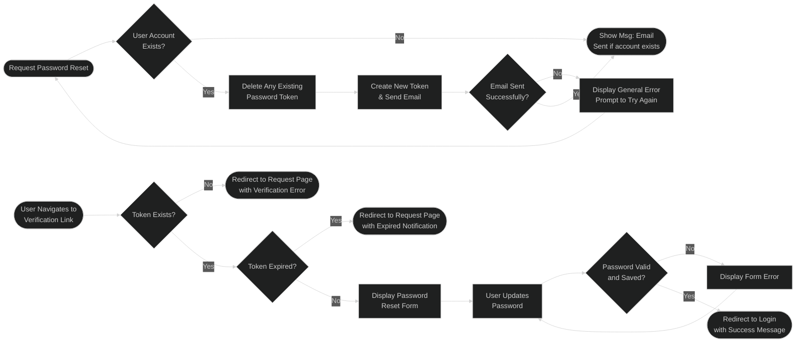
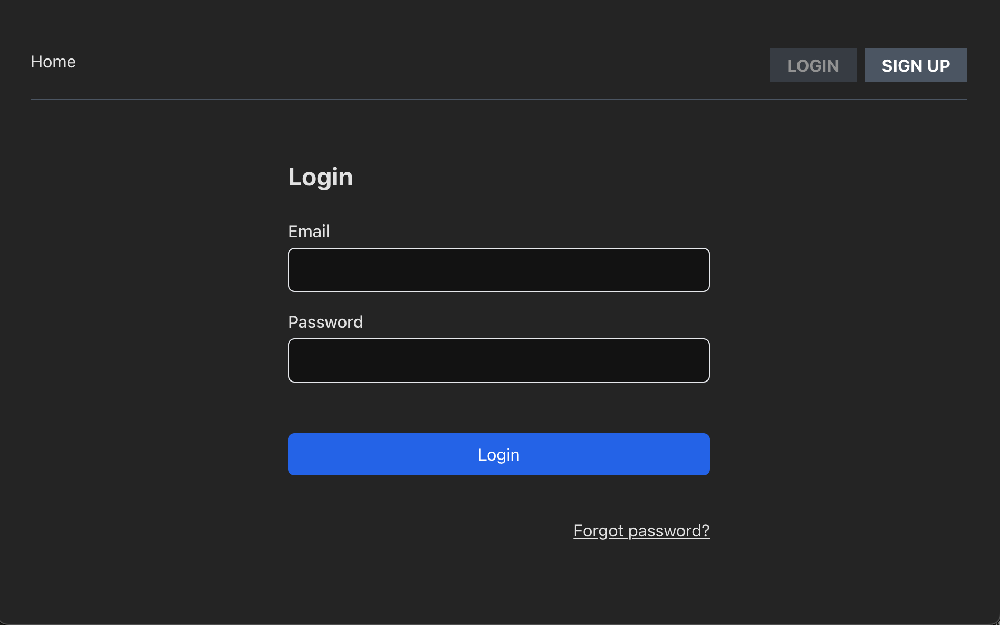
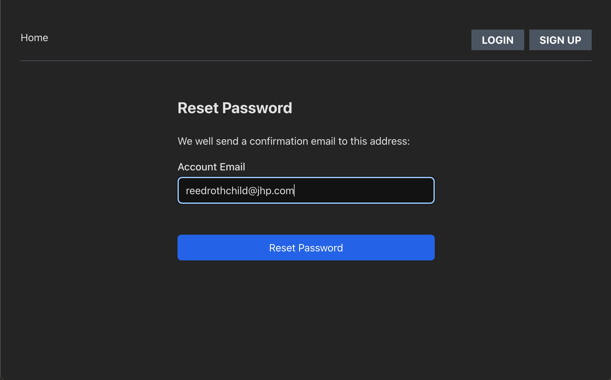
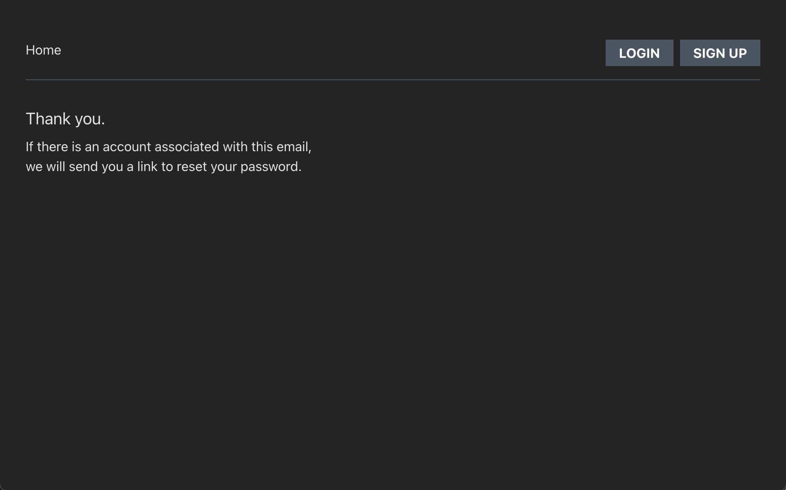
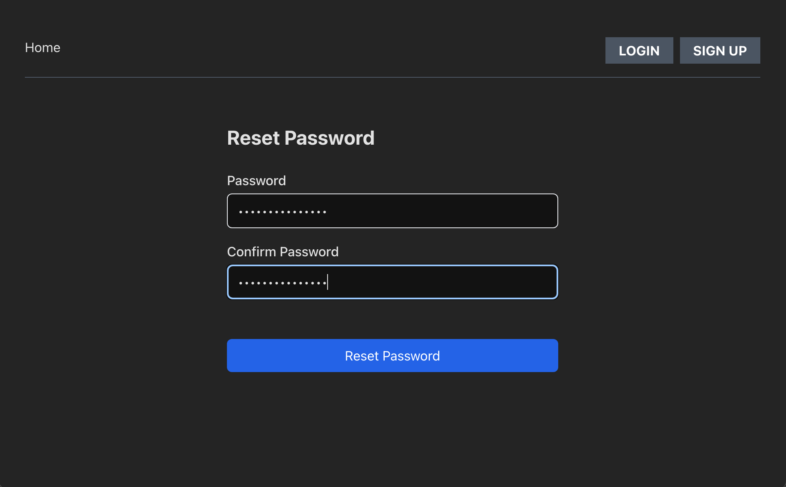
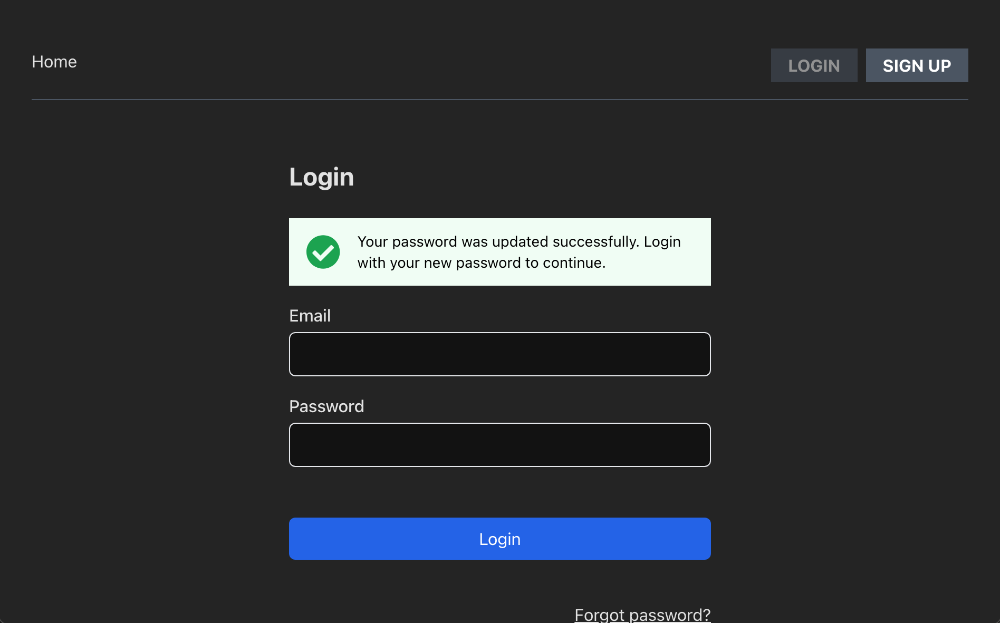

```mermaid
%%{init: {
  "theme": "dark", 
  "themeVariables": { 
    "primaryColor": "#ff6e6e", 
    "secondaryColor": "#feb236", 
    "tertiaryColor": "#6cb1ff" 
  },
  "flowchart": {
    "htmlLabels": true,
    "curve": "basis"
  }
}}%%

flowchart LR
    Start([Request Password Reset]) --> ValidateUser{User Account<br/>Exists?}
    
    ValidateUser -->|No| RequestReceived([Show Msg: Email <br> Sent if account exists])
    
    ValidateUser -->|Yes| CheckExisting[Delete Any Existing<br/>Password Token]
    CheckExisting --> CreateToken[Create New Token<br/>& Send Email]
    
    CreateToken --> EmailSent{Email Sent<br/>Successfully?}
    EmailSent -->|No| FormError[Display General Error<br/>Prompt to Try Again]
    FormError --> Start
    
    EmailSent -->|Yes| RequestReceived


    UserClicksLink([User Navigates to<br>Verification Link]) --> VerifyToken{Token Exists?}
    
    VerifyToken -->|No| RedirectRequest1([Redirect to Request Page<br/>with Verification Error])
    
    VerifyToken -->|Yes| CheckExpiry{Token Expired?}
    
    CheckExpiry -->|Yes| RedirectRequest2([Redirect to Request Page<br/>with Expired Notification])
    
    CheckExpiry -->|No| ShowForm[Display Password<br/>Reset Form]
    
    ShowForm --> UpdatePassword[User Updates<br/>Password]
    
    UpdatePassword --> PasswordValid{Password Valid<br/>and Saved?}
    
    PasswordValid -->|No| FormError3[Display Form Error]
    FormError3 --> UpdatePassword
    
    PasswordValid -->|Yes| Success([Redirect to Login<br/>with Success Message])
```

    
# UI

---

---

---

---

---

---
