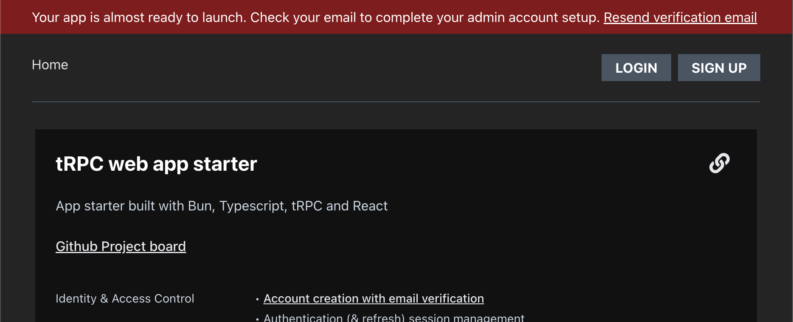
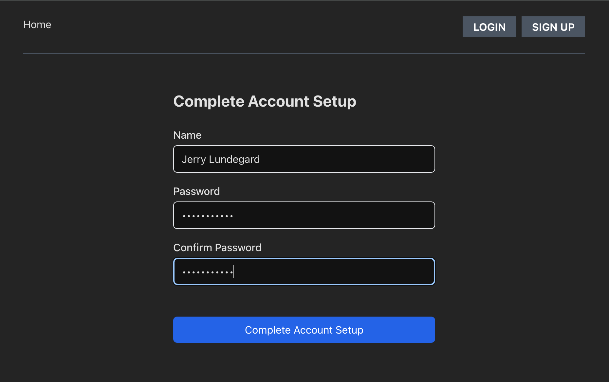
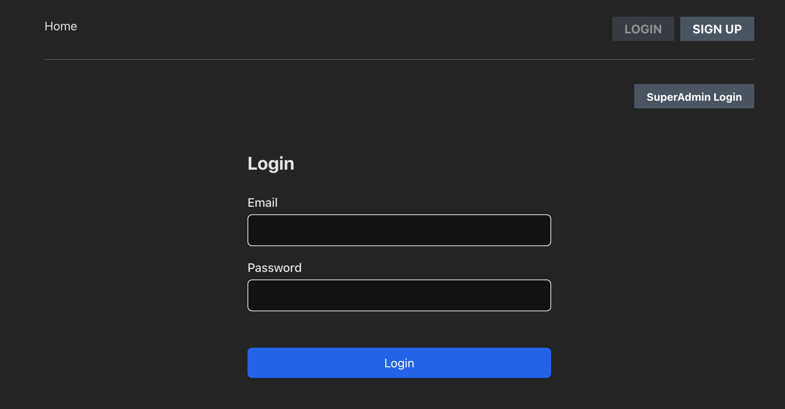

# Super Admin Setup 
## Production Workflow 
- Initial production build requires a SUPER_ADMIN_EMAIL environment variable to initialize admin setup.  
- Production build sends email to SUPER_ADMIN_EMAIL address.
- A missing or invalid environment variable will fail the initial build.
- Failure to confirm email has been sent will fail the initial build.
- Email verification link takes site owner to setup form to complete admin account setup. 
- A resend verification email option is available if admin setup fails

    
### UI    

Initial Sucessful Build    

---
Follow Up Successful Build

---
Initial Failed Build (missing SUPER_ADMIN_EMAIL env variable)

---

---

---

---

---

## DEV Workflow 
- Iniitial dev build creates an automated dev super admin account 
- Dev environment includes a one-click login for super admin access 

### UI

---

---

---