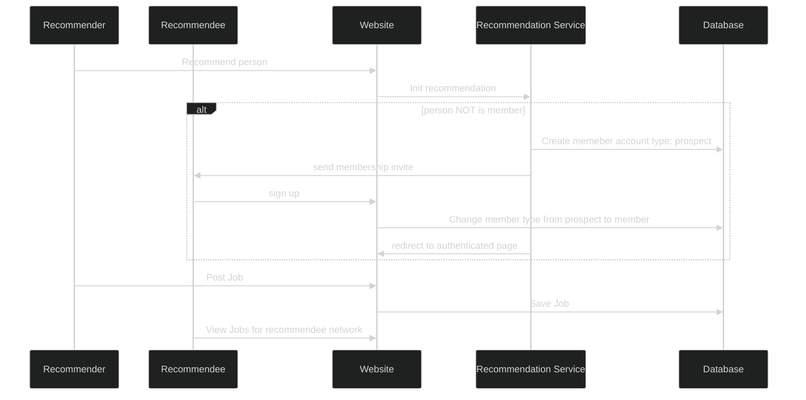

# User Auth Sequence

```mermaid
%%{init: {"theme": "dark", "themeVariables": { "primaryColor": "#ff6e6e", "secondaryColor": "#feb236", "tertiaryColor": "#6cb1ff" }}}%%

sequenceDiagram
  participant Recommender
  participant Recommendee
  participant Website
  participant Recommendation Service
  participant Database

  Recommender->>Website: Recommend person
  Website->>Recommendation Service: Init recommendation
  alt person NOT is member
    Recommendation Service->>Database: Create memeber account type: prospect
    Recommendation Service->>Recommendee: send membership invite
    Recommendee->>Website: sign up
    Website->>Database: Change member type from prospect to member
    Recommendation Service->>Website: redirect to authenticated page
  end

  Recommender->>Website: Post Job
  Website->>Database: Save Job
  Recommendee->>Website: View Jobs for recommendee network
```
